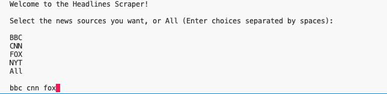
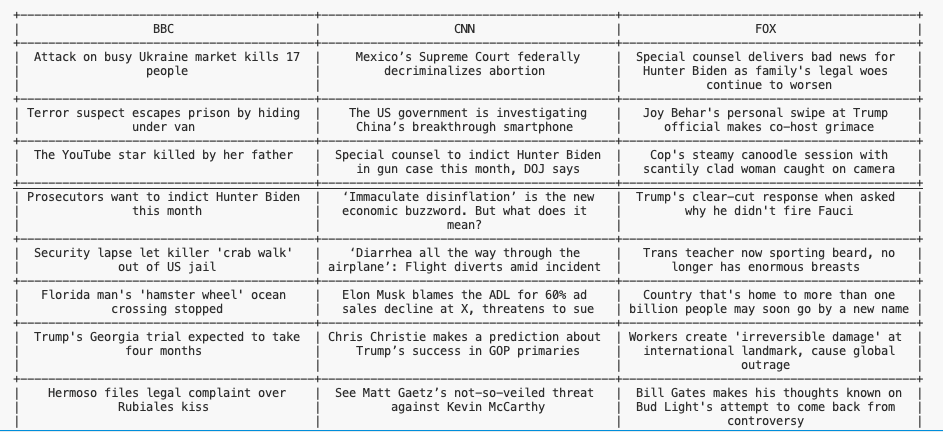

# NewsHeadlinesScraper

## Description

A tool designed to fetch and compare headlines from leading news sources like BBC, CNN, FOX, and NYT. 


## Features
- Fetch headlines from sites like BBC, CNN, FOX, and NYT.
- Display headlines side by side for comparative analysis.
- Customize the sources you want to scrape through user input.


## Installation and Setup

1.) Clone the repository:
   ```bash
   git clone https://github.com/FarisKarim/NewsHeadlinesScraper.git
   ```
2.) Navigate to the project directory

3.) Activate the virtual environment:
   ```bash
   source venv/bin/activate
   ```

4.) Install the required libraries and dependencies:
   ```bash
   pip3 install -r requirements.txt
   ```

5.) Run the scraper with python3 main.py
   ```bash
   python3 main.py
   ```

## Usage

Select the news sources you want



The results for each news source will be joined in a table for side-by-side comparison.




## Future Enhancements
Some improvements that are on the way:

- More news sources
- Headlines tailored to specific regions or countries through user input
- Add tech sites for tech news

